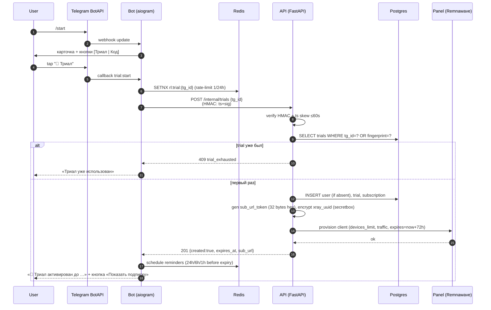
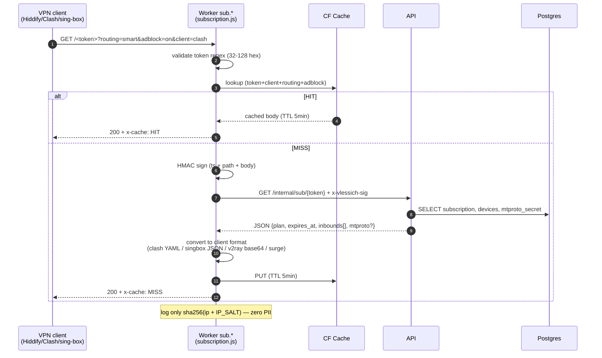
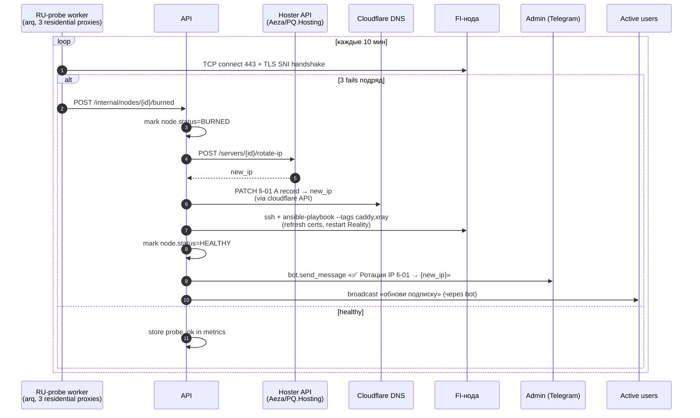
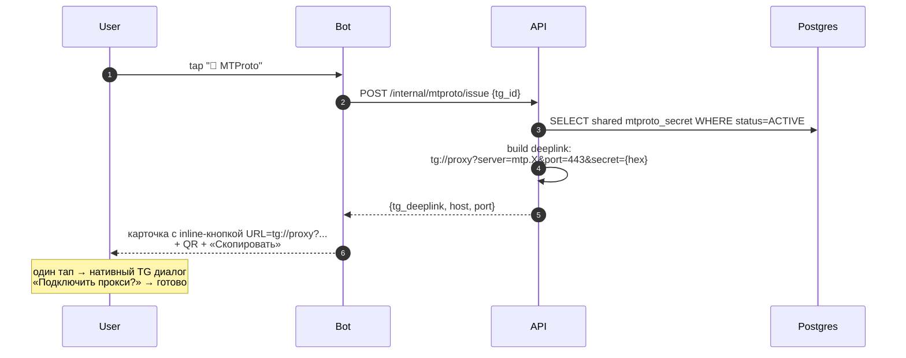
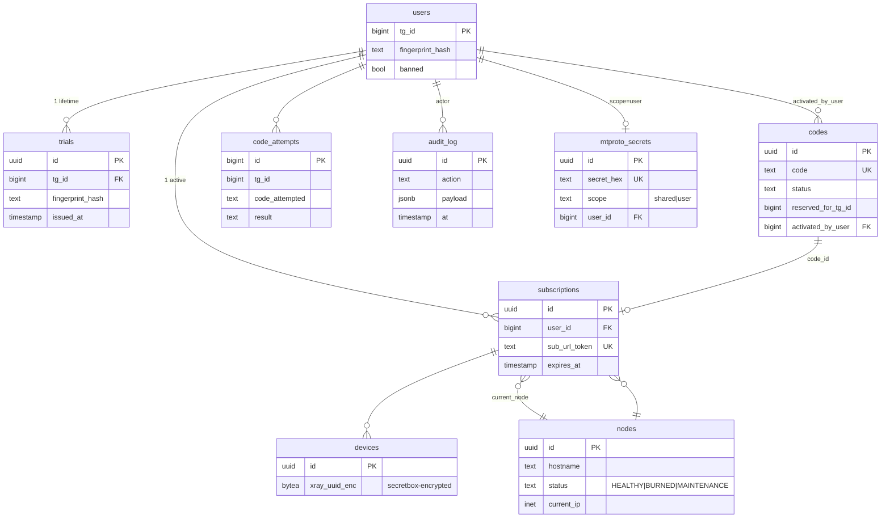

# Vlessich · Architecture

**Версия:** 1.0
**Дата:** 20.04.2026
**Источники:** `TZ.md` v1.3, `Design.txt`, `PROMPT.md`, текущий состав репо.

---

## 1. Зачем этот документ

Carta компонентов и потоков данных Vlessich. Используется как:

- ориентир при написании кода (что куда ходит, какой контракт);
- основа Definition-of-Done для каждого этапа (если поток не покрыт — этап не закрыт);
- entry-point для нового разработчика / агента.

Все выкладки опираются на ТЗ: §3 (архитектура), §11A (доменная инфра / Cloudflare),
§12 (БД), §10 (нода), §9A (MTProto).

---

## 2. Зоны ответственности

| Зона | Где живёт | Кто ходит туда |
|---|---|---|
| **Edge (CF)** | Cloudflare Pages + Workers + Access + WAF | пользователи, админы, клиенты VPN |
| **Control-plane** | Отдельный VPS (Linux + Docker) | bot, api, redis, postgres, panel (Remnawave) |
| **Data-plane (FI-нода)** | Helsinki VPS (Ubuntu 24.04 + Docker) | VPN-клиенты пользователей, MTProto-клиенты |
| **Storage / Secrets** | Postgres 16, Redis 7, sops+age | control-plane, api |
| **Observability** | Prometheus + Loki + Grafana + Uptime-Kuma | команда |

Жёсткое разделение: control-plane **никогда** не принимает VPN-трафик; FI-нода
**никогда** не получает прямой пользовательский HTTP к API.

---

## 3. Component diagram

```mermaid
flowchart TB
  subgraph TG["Telegram"]
    User(["👤 User<br/>(RU)"])
    Admin(["🛠 Admin"])
    BotAPI[["Telegram Bot API"]]
  end

  subgraph CFEdge["Cloudflare Edge (proxied)"]
    Pages_App["Pages: app.<br/>(webapp)"]
    Pages_Admin["Pages: admin.<br/>(admin panel)"]
    Worker_Sub["Worker: sub.<br/>(subscription.js)"]
    Worker_DoH["Worker: dns.<br/>(doh.js)"]
    Access["Zero Trust Access<br/>(admin only)"]
    WAF["WAF + RateLimit"]
  end

  subgraph CP["Control-plane VPS"]
    Bot["aiogram 3 bot<br/>(webhook)"]
    API["FastAPI<br/>(api.<domain>)"]
    Redis[("Redis 7<br/>FSM + RL + cache")]
    PG[("PostgreSQL 16")]
    Panel["Remnawave panel"]
    Workers_BG["arq workers<br/>(reminders, probes)"]
  end

  subgraph FI["FI Node — Helsinki (data-plane, non-proxied)"]
    Caddy["Caddy 2<br/>:80/:443 фасад"]
    Xray["Xray-core<br/>4 inbounds"]
    AGH["AdGuard Home<br/>127.0.0.1:53"]
    MTG["mtg<br/>:8443 MTProto"]
    NFT["nftables + fwknop<br/>+ Cowrie :22"]
    NodeAgent["Remnawave agent"]
  end

  subgraph Obs["Observability"]
    Prom["Prometheus"]
    Loki["Loki"]
    Graf["Grafana"]
    Kuma["Uptime-Kuma<br/>status.<domain>"]
  end

  subgraph Sec["Secrets / IaC"]
    Sops["sops + age"]
    TF["Terraform<br/>(infra/cloudflare.tf)"]
    Ans["Ansible<br/>(roles/node)"]
  end

  User -->|HTTPS| BotAPI
  BotAPI -->|webhook| WAF
  WAF --> Bot
  User -->|"Mini-App<br/>(initData)"| Pages_App
  Pages_App -->|"x-telegram-initdata"| WAF --> API

  Admin -->|browser + Email auth| Access --> Pages_Admin
  Pages_Admin -->|cookie| WAF --> API

  Bot <-->|HMAC<br/>x-vlessich-sig| API
  API <--> PG
  API <--> Redis
  Bot <--> Redis
  API -->|provision/revoke| Panel
  Panel -->|gRPC/HTTPS| NodeAgent
  Workers_BG --> API
  Workers_BG --> Bot

  User -->|"VPN client<br/>opens sub URL"| Worker_Sub
  Worker_Sub -->|HMAC<br/>/internal/sub/{token}| API
  Worker_Sub -->|"singbox/clash/<br/>v2ray response"| User

  User -->|"VPN tunnel<br/>VLESS+Reality+XHTTP/Vision/Hy2"| Xray
  User -->|"DoH<br/>(optional)"| Worker_DoH
  Xray -->|DNS queries| AGH
  AGH -->|upstream DoH/DoT| Worker_DoH

  User -->|"tg://proxy?...<br/>MTProto"| MTG

  Caddy -->|fallback target<br/>127.0.0.1:8443| Xray
  NFT -.protects.- Xray
  NFT -.protects.- MTG
  NFT -.protects.- Caddy
  NodeAgent -->|stats / config sync| Panel

  NodeAgent -->|node_exporter<br/>+ promtail| Prom & Loki
  API --> Prom
  Prom --> Graf
  Loki --> Graf

  Sops --> TF --> CFEdge
  Sops --> Ans --> FI
```

**Чтение:**

- сплошная стрелка `-->` — синхронный запрос/ответ;
- штриховая `-.->` — фоновое влияние (firewall защищает, но не «зовёт»);
- `<-->` — двунаправленный канал.

---

## 4. Domain map (поддомены)

| Поддомен | Тип | Назначение | TZ |
|---|---|---|---|
| `example.com` | proxied A → CP | Лендинг-фасад («Finnish Cloud Services») | §11A.1 |
| `www.` | proxied CNAME | alias для apex | §11A.1 |
| `api.` | proxied A → CP | FastAPI backend | §11A.1 |
| `app.` | proxied CNAME → Pages | Telegram Mini-App | §11A.7 |
| `admin.` | proxied CNAME → Pages, **Access-protected** | Admin panel | §11A.5 |
| `sub.` | proxied A → CP, **Worker route** | Subscription URL (edge) | §11A.3 |
| `dns.` | proxied A, **Worker route** | DoH endpoint | §11A.4 |
| `status.` | proxied A → CP | Uptime-Kuma | §11A.1 |
| `fi-01.` | **non-proxied** A | VPN inbound (Reality/XHTTP/Hy2) | §10 |
| `mtp.` | **non-proxied** A | MTProto-прокси (mtg) | §9A |

Cloudflare НЕ пропускает не-HTTP трафик → VPN/MTProto обязаны быть non-proxied.
Реальный IP светится только для `fi-01.` и `mtp.` — остальное скрыто за CF.

---

## 5. Sequence: Триал (Поток A, TZ §4.1)



**Edge cases:**
- Аккаунт <30 дней → бот просит share-phone до шага 4, fingerprint считается из `phone+tg_id+IP_SALT` (TZ §4.1).
- Если Panel вернула 5xx → API откатывает транзакцию (BEGIN/ROLLBACK), bot показывает retry-prompt.

---

## 6. Sequence: Активация кода (Поток B, TZ §4.2)

```mermaid
sequenceDiagram
    autonumber
    participant U as User
    participant B as Bot
    participant R as Redis
    participant A as API
    participant DB as Postgres
    participant P as Panel

    U->>B: tap "🔑 У меня есть код"
    B->>U: ACTIVATE_PROMPT (FSM=waiting_code)
    U->>B: "NEON-7F3K-P9QX"
    B->>B: regex /^[A-Z0-9]{4}(-[A-Z0-9]{4}){2}$/
    B->>R: INCR rl:code:{tg_id} (5/10min)
    alt rate-limit hit
        B-->>U: «Слишком много попыток» + капча (через 5)
    else ok
        B->>A: POST /internal/codes/activate {tg_id, code}
        A->>DB: BEGIN; SELECT FOR UPDATE codes WHERE code=?
        A->>A: validate status∈{CREATED}, valid_from≤now≤valid_until,<br/>reserved_for_tg_id ∈ {NULL, tg_id}
        alt invalid
            A->>DB: INSERT code_attempts (failed)
            A->>DB: COMMIT
            A-->>B: 422 {code: bad_code|expired|used|reserved}
            B-->>U: localized error
        else valid
            A->>DB: UPDATE codes SET status=ACTIVE, activated_by_user, activated_at
            A->>DB: UPSERT user; INSERT/UPDATE subscription<br/>(invariant: 1 active per user_id)
            A->>A: gen sub_url_token, encrypt xray_uuid
            A->>P: provision (devices_limit, traffic, expires=now+duration_days)
            P-->>A: ok
            A->>DB: INSERT audit_log
            A->>DB: COMMIT
            A-->>B: 200 {sub_url, expires_at, plan}
            B-->>U: ACTIVATE_OK card + [Показать подписку] [QR]
        end
    end
```

**Инвариант (TZ §4.5):** одна активная subscription на `user_id`.
Если у юзера уже есть subscription:
- статус `ACTIVE` → `expires_at += duration_days` (продление);
- статус `EXPIRED` → `expires_at = now + duration_days` (замена).

---

## 7. Sequence: Subscription URL (через CF Worker)



**Зачем edge:** снижает нагрузку на API в 50-100x при популярных подписках (один токен дёргается клиентом каждые 30 мин), даёт географическую близость к юзеру (CF anycast), скрывает реальный IP бэкенда.

---

## 8. Sequence: Ротация IP при «BURNED» (TZ §11)



**Когда ротировать:** после 3 фейлов подряд (~30 мин даунтайма).
Раньше — слишком чувствительно (false positives от operator-side hiccups).

---

## 9. Sequence: MTProto issuance (TZ §9A)



**Без VPN-клиентов**, работает даже если Telegram частично режется — клиент сам
ходит через прокси.

---

## 10. Database schema (high-level)

См. TZ §12 для полей. Ниже — отношения:



Шифрование at-rest:
- `devices.xray_uuid_enc` — libsodium secretbox (`API_SECRETBOX_KEY`).
- `codes.code` — оставляем plaintext (нужен SELECT WHERE code=?), но защищаем
  на уровне БД (row-level), а **в логах** — только префикс `XXXX-****-****`.

---

## 11. Security boundaries

| Граница | Защита |
|---|---|
| User → bot/api | Cloudflare WAF + rate-limit (10/min `/activate`, 3/h `/trial`) |
| bot ↔ API | HMAC-SHA256 (`x-vlessich-sig`), clock skew ≤60s, общий `API_INTERNAL_SECRET` |
| sub-Worker ↔ API | тот же HMAC, secret в CF binding |
| webapp → API | Telegram `initData` (HMAC от bot_token, проверка на стороне API) |
| admin → API | Cloudflare Zero Trust Access (email-allowlist + опц. IP), cookie/JWT downstream |
| API ↔ DB | unix socket / loopback в compose, в prod — sslmode=require |
| FI-нода SSH | fwknop SPA → custom port → key-only, Cowrie на :22 |
| FI-нода internet | nftables drop policy, RST на незнакомые порты, scanner blocklist |

**No-PII rule:** все логи (bot, api, workers, AGH) хранят IP только как
`sha256(ip + IP_SALT)`. Телефоны хешируются перед записью fingerprint.
Логи Telegram-username — допустимы, но опционально.

---

## 12. Deploy topology

```mermaid
flowchart LR
    Dev["Developer laptop"] -->|git push| GH["GitHub repo"]
    GH -->|Actions| GHCR["GHCR<br/>(bot, api images)"]
    GH -->|Actions| Pages["CF Pages<br/>(webapp, admin)"]
    Dev -->|terraform apply<br/>(sops decrypt)| CF["Cloudflare<br/>(DNS+Workers+Access+WAF)"]
    Dev -->|"make deploy-node<br/>HOST=fi-01"| FI["FI VPS<br/>(ansible-playbook)"]
    GHCR -->|watchtower / manual pull| CP["Control-plane VPS"]
```

Никаких автоматических deploy в FI/CP без явной команды (`make`). Pages /
Workers / DNS — через Terraform plan→apply. Изменения в `cloudflare.tf` без
PR-ревью запрещены.

---

## 13. Open questions (для следующих этапов)

| # | Вопрос | Этап решения |
|---|---|---|
| Q1 | Remnawave vs Marzban в MVP — ТЗ допускает оба | Этап 1 (до создания клиента) |
| Q2 | Нужна ли отдельная микро-нода под mtg, или достаточно той же FI | Этап 2.5 |
| Q3 | Reality `serverNames` — `www.microsoft.com` или ротировать список | Этап 2 (после запуска первого Reality probe) |
| Q4 | Хранить ли `tg_username` в users (UX vs PII) | Этап 1 (до создания миграции) |
| Q5 | Public free-tier MTProto (TZ §9A.6) — включаем в MVP? | Этап 4 (после боевой проверки) |

---

## 14. Mini-App ↔ Backend contract (Stage 3)

### Auth: Telegram initData (TZ §11B)

Webapp шлёт в каждом запросе заголовок `x-telegram-initdata: <raw query>`.
Backend проверяет:

```
secret_key = HMAC_SHA256(key=b"WebAppData", msg=bot_token)
expected   = HMAC_SHA256(key=secret_key, msg=data_check_string).hex()
hmac.compare_digest(expected, fields["hash"])
assert now - fields["auth_date"] <= 86400
```

`data_check_string` — поля `k=v`, отсортированные по ключу, через `\n`,
**без** `hash`. Реализация: `app/auth/telegram.py::verify_init_data`.

### Endpoints

| Path                                      | Auth     | Notes                                 |
|-------------------------------------------|----------|---------------------------------------|
| `GET /v1/webapp/bootstrap`                | initData | `{user, subscription|null}`           |
| `GET /v1/webapp/subscription`             | initData | `{sub_token, urls, devices, flags}`   |
| `POST /v1/webapp/subscription/toggle`     | initData | `{adblock?, smart_routing?}` — 422 if both null |
| `POST /v1/webapp/devices/{id}/reset`      | initData | RL 5/min/user; 403 if not owner       |

### Sub-URL format (public, для VPN-клиентов)

`https://<settings.sub_worker_base_url>/<sub_token>?client=<v2ray|clash|singbox|surge|raw>`

Mini-App получает только URL-список — **не проксирует** VPN payload.
Edge sub-Worker конвертирует в нужный формат (Stage 2 T8).

### Deeplink схемы импорта

- v2rayNG: `v2rayng://install-sub/?url=<enc>&name=Vlessich`
- Clash: `clash://install-config?url=<enc>&name=Vlessich`
- sing-box: `sing-box://import-remote-profile?url=<enc>&name=Vlessich`
- Surge: `surge:///install-config?url=<enc>`

Builders: `webapp/src/lib/deeplinks.ts`.

## 15. Admin UI ↔ Backend contract (Stage 4)

### Stack

React 18 + Vite + TS + Tailwind + **TanStack Query v5**. Spotify-dark по
`Design.txt`. Хост: `admin/` (порт dev 5174). В прод — статика за
Cloudflare Access.

### Auth: JWT Bearer

`POST /admin/auth/login` `{email, password}` → `{access_token, role}`
(HS256, TTL 1h). Токен хранится в `sessionStorage` под ключом
`vlessich.admin.jwt`. На любой `401` от backend — клиент чистит токен и
делает `window.location.assign("/login")`. Никаких refresh-токенов в
Stage 4 (по locked-решению — пользователь логинится заново раз в час).

### RBAC matrix

| Endpoint | readonly | support | superadmin |
|---|---|---|---|
| `GET /admin/stats` | ✓ | ✓ | ✓ |
| `GET /admin/codes`, `/users`, `/subscriptions`, `/audit`, `/nodes` | ✓ | ✓ | ✓ |
| `GET /admin/nodes/{id}/health` | ✓ | ✓ | ✓ |
| `POST /admin/codes`, `DELETE /admin/codes/{id}` | — | ✓ | ✓ |
| `POST /admin/subscriptions/{id}/revoke` | — | ✓ | ✓ |
| `POST /admin/nodes`, `PATCH /admin/nodes/{id}` | — | — | ✓ |

Frontend дополнительно скрывает кнопки через `hasRole(actual, required)`
с ranks `superadmin=3 > support=2 > readonly=1`.

### Endpoints (Stage 4 additions)

| Path | Auth | Notes |
|---|---|---|
| `GET /admin/stats` | JWT | Сводка для dashboard (10 counts: users/codes/subs/nodes buckets) |
| `POST /admin/subscriptions/{id}/revoke` | JWT support+ | `status=REVOKED`, `expires_at=now()` |
| `GET /admin/nodes/{id}/health` | JWT | `uptime_24h_pct`, `latency_p50/p95_ms`, recent 50 probes |

### Node health pipeline

Таблица `node_health_probes`:
```
id          uuid  pk
node_id     uuid  fk → nodes.id
probed_at   timestamptz
ok          bool
latency_ms  int  null
error       text null
INDEX (node_id, probed_at DESC)
```

Сейчас probes пишутся внешним процессом / Stage 5 active prober. Admin
UI читает их через `GET /admin/nodes/{id}/health`. Расчёты:

- `uptime_24h_pct` = `100 * count(ok) / count(*)` за последние 24h.
- `latency_p50_ms`, `latency_p95_ms` — percentile_cont на `latency_ms`
  где `ok=true`.

### TanStack Query keys (convention)

```
["stats"]
["codes", { status, plan, tag, page }]
["users", { tg_id, page }]
["subs",  { status, plan, user_id, page }]
["audit", { action, actor_type, page }]
["nodes"]
["node-health", id]
```

Refetch intervals:
- `["stats"]` — 30s (Dashboard)
- `["nodes"]` — 30s (NodesPage)
- `["node-health", id]` — 15s (NodeHealthDrawer, только пока открыт)

### Design-system inventory

См. `admin/README.md` — полный список компонентов в `admin/src/components/`.

## 16. Active Probing + IP Rotation (Stage 5)

### Pipeline

```
┌──────────────┐   every probe_interval_sec (default 60s)
│  prober loop │──────────────────────────────────────────┐
└──────┬───────┘                                          │
       │ SELECT id, hostname FROM nodes                   │
       │ WHERE status != 'MAINTENANCE'                    │
       ▼                                                  │
┌────────────────────────┐                                │
│ asyncio.gather(        │  per-node timeout = probe_     │
│   ProbeBackend.probe() │  timeout_sec (default 5s)      │
│ ) → list[ProbeResult]  │                                │
└──────┬─────────────────┘                                │
       │                                                  │
       ▼   single transaction                             │
┌────────────────────────────────────────────────┐        │
│ INSERT node_health_probes (ok, latency_ms, …) │        │
│ UPDATE nodes SET last_probe_at = now()         │        │
│ IF state transition:                           │        │
│   UPDATE nodes SET status = …                  │        │
│   INSERT audit_log (node_burned|node_recovered)│        │
└────────────────────────────────────────────────┘        │
                                                          │
       sleep(probe_interval_sec) ◄───────────────────────┘
```

### BURN / RECOVER state machine

```
             probe_burn_threshold fails подряд (default 3)
       ┌────────────────────────────────────────────────┐
       │                                                ▼
  ┌─────────┐                                     ┌──────────┐
  │ HEALTHY │                                     │  BURNED  │
  └─────────┘                                     └────┬─────┘
       ▲                                               │
       │        probe_recover_threshold oks            │
       │        подряд (default 5, > burn — hysteresis)│
       └───────────────────────────────────────────────┘

  MAINTENANCE — ручной статус; prober пропускает ноду,
                переходы не отслеживаются.
```

- Counter (`consecutive_fails` / `consecutive_oks`) — **in-memory** в
  процессе `Prober`, `dict[UUID, _Counters]`. Сброс после transition.
- Intermittent failures (fails < threshold) не жгут: одна OK сбрасывает
  `consecutive_fails` в 0.
- `AuditLog` payload: `{hostname, consecutive_fails/oks, last_error?}`.
- При рестарте процесса счётчики обнуляются (safe — BURN/RECOVER просто
  потребуют N новых подряд проб).

### `ProbeBackend` Protocol (extensibility)

```python
class ProbeBackend(Protocol):
    async def probe(self, hostname: str, port: int,
                    timeout: float) -> ProbeResult: ...
```

MVP: `TcpProbeBackend` — `asyncio.open_connection(host, port)` с
`asyncio.wait_for(..., timeout)`. Без TLS-handshake, без данных —
open→close. `OSError` / `TimeoutError` → `ok=False, error=str(...)[:256]`.

Stage 6 hook: второй бэкенд через residential RU-прокси
(TZ §11.4) — проверка видимости ноды **изнутри РФ**. Prober инжектирует
backend в `__init__`, остальной код не меняется.

### Config (`api/app/config.py`)

| Setting | Env | Default | Назначение |
|---|---|---|---|
| `probe_interval_sec` | `API_PROBE_INTERVAL_SEC` | 60 | Интервал между циклами |
| `probe_timeout_sec` | `API_PROBE_TIMEOUT_SEC` | 5 | Таймаут одного probe |
| `probe_port` | `API_PROBE_PORT` | 443 | TCP-порт для connect |
| `probe_burn_threshold` | `API_PROBE_BURN_THRESHOLD` | 3 | Fails подряд → BURNED |
| `probe_recover_threshold` | `API_PROBE_RECOVER_THRESHOLD` | 5 | Oks подряд → HEALTHY |

### Manual rotate — `POST /admin/nodes/{id}/rotate`

Ручной endpoint для подтверждения внешней ротации IP (когда админ уже
поменял A-запись или vps-IP у хостера). Только `superadmin`. Атомарно
(`SELECT … FOR UPDATE`):

- сбрасывает `current_ip = NULL` (следующий probe зафиксирует новый);
- выставляет `status = 'HEALTHY'` (снимает BURNED);
- пишет `AuditLog(action='node_rotated')` с payload
  `{previous_ip, previous_status}` для форензики.

Реального вызова hoster-API в этом этапе нет — это **подтверждение**
внешнего действия. Admin UI: danger-кнопка «Rotate» в `NodesPage` →
`ConfirmDestructiveModal` (`confirmWord="ROTATE"`, warning «Сначала
смените IP у хостера»).

### Deployment

`docker-compose.dev.yml` сервис `prober`: reuses api image,
`command: python -m app.workers.prober`. Зависит от `db` и `api`.
Stage 6 добавил expose `127.0.0.1:9101` для Prometheus scrape.
Логи: `docker compose logs prober`.

## 17. Observability + Admin Captcha (Stage 6)

### Prometheus topology

Два независимых scrape-target'а — разные процессы, разные registries:

```
api (uvicorn :8000)        →  GET /metrics  (default REGISTRY)
prober worker (:9101)      →  GET /metrics  (start_http_server, отдельный процесс)
```

Prometheus scrape config (см. `infra/grafana/README.md`):

```yaml
- job_name: vlessich-api
  static_configs: [{ targets: ['api:8000'] }]
- job_name: vlessich-prober
  static_configs: [{ targets: ['prober:9101'] }]
```

### Метрики

| Source | Metric | Type | Labels |
|---|---|---|---|
| api | `vlessich_http_request_duration_seconds` | Histogram | `method`, `path_template`, `status` |
| api | `vlessich_admin_login_total` | Counter | `result` ∈ {success, fail, captcha_fail, rate_limited} |
| api | `vlessich_subscription_events_total` | Counter | `event` ∈ {issued, revoked, expired_auto} |
| prober | `vlessich_probe_duration_seconds` | Histogram | `ok` |
| prober | `vlessich_probe_total` | Counter | `ok` |
| prober | `vlessich_node_state` | Gauge (one-hot) | `node_id`, `hostname`, `status` |
| prober | `vlessich_node_burned_total` | Counter | — |
| prober | `vlessich_node_recovered_total` | Counter | — |

**Cardinality discipline**: `path_template` берётся из
`request.scope["route"].path` (не raw URL). `node_state` — one-hot per
(node, status). Никаких raw user-id/IP/email в labels.

### Middleware (API)

`MetricsMiddleware` (Starlette `BaseHTTPMiddleware`) оборачивает
каждый запрос; `/metrics` исключён из самоучёта. Длительность —
`time.perf_counter()`. На исключении — `status="500"` + reraise.

### Admin captcha (Cloudflare Turnstile)

```
admin (React)  ── token ──►  /admin/auth/login ── verify ──► challenges.cloudflare.com/siteverify
   <Turnstile>                  TurnstileVerifier             {success: true/false}
   widget (lazy CDN)
```

- Sitekey (`VITE_TURNSTILE_SITEKEY`) на фронте — публичен.
- Secret (`API_TURNSTILE_SECRET`) на бэке — обязателен для prod. Если
  unset → captcha **отключена** (dev). Token игнорируется.
- Verify reasons: `missing_token`, `siteverify_rejected`,
  `verify_http_error` → 400 `captcha_failed`.
- Rate-limit (10/60s per email) — отдельный layer, не заменяется
  captcha (defense-in-depth).
- Verifier injectable singleton (`get/set_captcha_verifier`) — тесты
  через `httpx.MockTransport`, без сети.

### Grafana

`infra/grafana/dashboards/vlessich.json` импортируется через UI
(Dashboards → Import). 6 panels (HTTP RPS, p95, admin login outcomes,
probe success ratio, node states table, subscription events).
Datasource — `${DS_PROMETHEUS}` (template var). Локально Grafana не
поднимается (избыточно).

### Что НЕ в этом этапе

- Loki / promtail (log aggregation) → Stage 7.
- Alert rules → Stage 7 (есть кандидаты в README).
- Residential RU probe backend → Stage 7 (через ProbeBackend Protocol
  hook из §16).
- mtg metrics → Stage 8 (нужен сам mtg контейнер).

Решения фиксируем в `docs/decisions/NNN-*.md` (ADR) по мере принятия.

## 18. Logs + Alerts + Dual-Source Probing (Stage 7)

Stage 7 закрывает три параллельные оси наблюдаемости: централизация
логов (Loki), формальные alert rules для Prometheus, и второй
`ProbeBackend` через residential RU прокси для региональной
телеметрии.

### Dual-source probing pipeline

```
┌──────────────┐
│ prober tick  │  every probe_interval_sec
└──────┬───────┘
       │ SELECT id,hostname FROM nodes WHERE status != 'MAINTENANCE'
       ▼
   per-node × per-backend = N × M coros in one asyncio.gather
       │
       ├── ("edge", TcpProbeBackend)         always on
       └── ("ru",   HttpProxyProbeBackend)   iff API_RU_PROXY_URL set
       │
       ▼  single transaction
┌─────────────────────────────────────────────────────────────┐
│ INSERT node_health_probes (..., probe_source='edge'|'ru')   │
│ — for source == 'edge' only:                                │
│     UPDATE nodes SET last_probe_at = now()                  │
│     run BURN/RECOVER state machine                          │
│     set_node_state(...) gauge                               │
└─────────────────────────────────────────────────────────────┘
```

**Edge-only state machine.** RU residential proxies are unreliable by
nature (rotating exits, blocked-by-DPI false positives). Letting them
flip `nodes.status` would page on-call for problems users don't have.
The `ru` source is therefore *telemetry only*: Prometheus counters
+ NodeHealthProbe rows, but never `BURNED` transitions. Operators
read the divergence in Grafana — `edge OK, ru FAIL` ≈ regional DPI
event.

**RU backend reachability semantics.** `HttpProxyProbeBackend` issues
a single GET via `httpx.AsyncClient(proxy=…, verify=False)`. Any HTTP
response (2xx..5xx) counts as `ok=True`: in RU the failure mode is
TCP RST / DNS poisoning, not application errors. Only
`httpx.HTTPError` (transport-level) is treated as failure. TLS verify
is intentionally disabled — we proxy raw hostnames, not validated
origins; reachability is the only signal we want.

### Data model

`node_health_probes.probe_source` (varchar(16), NOT NULL DEFAULT
`'edge'`, CHECK ∈ `{'edge','ru'}`). Backfill via
`server_default='edge'`. New index
`ix_node_probes_node_source_probed_at(node_id, probe_source,
probed_at)` supports per-source aggregations. Migration:
`alembic/versions/0004_stage7.py`.

`GET /admin/nodes/{id}/health` filters `probe_source = 'edge'` for all
five aggregates (last 50 probes, total_24h, ok_24h, p50, p95) so
historic uptime semantics are preserved.

### Metrics extension

`PROBE_TOTAL` and `PROBE_DURATION_SECONDS` (Stage 6) gain a `source`
label. Pre-Stage-7 PromQL must be updated to
`{source="edge"}` to keep apples-to-apples — see Grafana dashboard
queries in `infra/grafana/dashboards/vlessich.json`.

### Alert rules

`infra/prometheus/rules/vlessich.yml` — five alerts, severity tiered:

| Alert | Severity | Trigger |
|---|---|---|
| `NodeBurnSpike`         | warning  | `> 2` BURN transitions in 15m |
| `ProbeSuccessLow`       | warning  | edge success ratio `< 0.8` for 10m |
| `ProberDown`            | critical | scrape target down for 5m |
| `ApiP95Latency`         | warning  | `histogram_quantile(0.95, ...) > 1s` for 5m |
| `AdminCaptchaFailSpike` | info     | `rate(captcha_fail) > 0.2/s` for 5m |

Alertmanager wiring is deploy-time (out of repo). `ProbeSuccessLow`
intentionally filters `source="edge"` so noisy RU residential
backends never page anyone.

### Loki + promtail

`infra/loki/` — single-binary Loki (tsdb + filesystem, 7d retention)
and promtail Docker SD pipeline. Promtail keeps containers labelled
`com.docker.compose.project=vlessich*`, parses structlog JSON, and
promotes `level` / `logger` to Loki labels alongside the docker
`service` label and the static `external_labels.env`.

Label contract:

- `service` ∈ `{api, reminders, prober, bot}` (compose service).
- `level`   ∈ `{debug, info, warning, error}`.
- `logger`  — structlog logger name (e.g. `prober`, `admin.auth`).
- `env`     — static, `dev` / `staging` / `prod`.

PII discipline unchanged: API hashes IPs via `sha256(ip + IP_SALT)`
before logging; promtail must not introduce new fields.

### Config

| Setting | Env | Default | Назначение |
|---|---|---|---|
| `ru_proxy_url` | `API_RU_PROXY_URL` | unset | Residential RU proxy URL (unset → backend disabled). |
| `ru_probe_timeout_sec` | `API_RU_PROBE_TIMEOUT_SEC` | 8.0 | Per-probe HTTP timeout via RU proxy. |

### Что НЕ в этом этапе

- Alertmanager / PagerDuty / Slack wiring (deploy-time).
- Loki в `docker-compose.dev.yml` (локально не нужен).
- Per-source панели в Grafana дашборде (Stage 8 cleanup).
- RU result как BURN signal — пока telemetry only (см. rationale выше).

## 19. MTProto (mtg) Wiring + Rotation (Stage 8)

Stage 8 привязывает MTProto-прокси `mtg` к control-plane: контейнер
появляется в `docker-compose.dev.yml`, API сам сидит shared-пул при
старте из env, а superadmin умеет ротировать секрет одним POST'ом.
Per-user MTProto (scope='user') отложен до Stage 9 — без
`[replicas]` / N контейнеров mtg не умеет обрабатывать разные
секреты на одном порту.

### Topology (dev)

```
bot ─HMAC──▶ api:/internal/mtproto/issue ──┐
                                           ▼
                                    MtprotoSecret pool
                                    (scope='shared', ACTIVE)
                                           │
                                           ▼
                                 tg://proxy?server=mtg&port=8443&secret=ee…
                                           │
                                           ▼
                                    mtg:8443 (host-bound)
                                    mtg:9410 (/metrics, 127.0.0.1 only)
                                           │
                                           ▼
                                    Prometheus: vlessich-mtg scrape
                                    Alert: MtgDown (critical, up==0 5m)
                                    Grafana: panel id=8 «MTProto (mtg) up»
```

В prod `mtg` живёт на отдельном VPS (`mtp.example.com`, TZ §9A.8) —
control-plane остаётся тем же, меняется только `API_MTG_HOST`.

### Seed semantics (startup)

`app/startup/mtproto_seed.py::seed_shared_secret`:

1. Если `API_MTG_SHARED_SECRET_HEX` unset → no-op, лог `mtproto.seed.skip reason=no_env`.
2. Если значение не матчит `^[0-9a-f]{32}$` → no-op + warning (не
   raise: миссконфиг не должен рушить старт).
3. Если уже есть `MtprotoSecret(scope='shared', ACTIVE)` → no-op,
   `reason=already_present`.
4. Иначе INSERT одной строки с `secret_hex=env`, `cloak_domain=
   API_MTG_SHARED_CLOAK`, `status=ACTIVE`.

Идемпотентность критична: lifespan вызывается на каждый старт API,
а в prod пул живёт между рестартами. Юнит-тест
`test_mtproto_seed.py` verify 4 ветки.

### Rotation flow (admin)

`POST /admin/mtproto/rotate` (superadmin-only):

```
1. SELECT MtprotoSecret FOR UPDATE
   WHERE scope='shared' AND status='ACTIVE'
2. IF found: current.status := REVOKED
3. new := MtprotoSecret(
     secret_hex = secrets.token_hex(16),
     cloak_domain = payload.cloak_domain OR settings.mtg_shared_cloak,
     scope='shared', status='ACTIVE'
   )
4. INSERT AuditLog(action='mtproto_rotated',
                   payload={cloak_domain, revoked_secret_id})
5. Commit.
6. Response: {secret_id, secret_hex, cloak_domain, full_secret,
              config_line, host, port, rotated_at, revoked_secret_id}
```

**Manual step**: оператор копирует `config_line` в
`mtg/config.toml` на mtg-VPS и делает `docker compose restart mtg`.
Auto-rebroadcast новых deep-links (TZ §9A.7) — отдельная задача
follow-up stage (требует bot-side mass DM).

**Security invariants** (проверены тестами):
- `AuditLog.payload` **никогда** не содержит `secret_hex` / `full_secret`.
- secret_hex — `CHAR(64) UNIQUE NOT NULL`, коллизия поломает INSERT
  (обрабатывается SQL-исключением → 500).
- `require_admin_role("superadmin")` — support/readonly получают
  403 ещё до rotation logic.

### Per-user MTProto — Stage 9

Почему не в Stage 8: `mtg` umeет только один секрет на порт.
Per-user требует либо:
- mtg `[replicas]`-режима (pro feature, отдельная лицензия), или
- N контейнеров mtg на портах 8443..84XX с reverse-proxy, или
- кастомный MTProto-proxy форк.

Данные готовы: `MtprotoSecret.scope='user'` + FK `user_id` +
`mtproto_scope_user_consistency` CHECK — Stage 9 переключит только
ветку в `routers/mtproto.py`. Пока scope='user' → 501
`not_implemented`, бот surfaces чистый RU-текст.

### Prometheus topology

Новый scrape target `vlessich-mtg` (job_name=`vlessich-mtg`,
static_configs=`[mtg:9410]`, scrape_interval=15s). Alert `MtgDown`
живёт в группе `vlessich.mtg`, severity=critical. В Grafana
дашборде добавлена stat-panel id=8 «MTProto (mtg) up» (thresholds:
red<0.5, green>=0.5).

### Что НЕ в этом этапе

- Per-user MTProto (см. выше) — Stage 9.
- Auto-rotation по расписанию (cron) — пока ручной admin action.
- Auto-rebroadcast deeplinks после ротации — требует Bot-side mass DM.
- Admin UI страница для mtg (rotate-button + current secret id) —
  backend endpoint готов, UI отложен.

## 20. Per-User MTProto Pool (Stage 9)

### Проблема

`mtg` форвардит трафик ТОЛЬКО для секретов, статически прописанных в
`config.toml`. Это значит — API не может «выдать пользователю
свежесгенерированный секрет» в рантайме: mtg его просто не знает.
Для per-user MTProto нужен механизм, где секреты создаются оператором
вместе с mtg-контейнерами, а API только привязывает существующие
секреты к пользователям.

### Модель: FREE-pool + operator bootstrap

**Source-of-truth = БД** (`mtproto_secrets` table, `scope='user'`).

Статусы (per-user):
- `FREE` — секрет создан, порт выделен, но пользователя ещё нет.
  Pre-seeded оператором через `/admin/mtproto/pool/bootstrap`.
- `ACTIVE` — привязан к `user_id`. Allocator флипает FREE→ACTIVE.
- `REVOKED` — бывший ACTIVE. Порт остаётся закреплён за этой строкой
  (mtg всё ещё форвардит этот секрет до rebuild конфига). Не
  возвращается в FREE.

### Bootstrap flow

```
Operator
  │
  │  POST /admin/mtproto/pool/bootstrap
  │    {"count": 16, "port_base": 8443, "cloak_domain": "..."}
  ▼
API
  │ 1. Skip ports already in DB (scope='user', any status)
  │ 2. INSERT rest as FREE rows (lowercase hex secret + port + cloak)
  │ 3. AuditLog mtproto_pool_bootstrapped {inserted_ports, skipped_ports}
  │    — без secret material
  │ 4. Response (ONE-TIME, full secret material)
  ▼
Operator
  │  ansible-playbook ... -e "mtg_per_user_enabled=true" \
  │       -e "@pool_items.json"
  ▼
Ansible (roles/node/tasks/mtg_per_user.yml)
  │ 1. Render /opt/mtg/pool/{port}.toml from mtg.pool.config.toml.j2
  │ 2. Install systemd templated unit mtg@.service
  │ 3. systemctl enable + start mtg@<port>.service per item
  ▼
mtg containers listening on [port_base, port_base+count)
```

### Allocator

```sql
SELECT * FROM mtproto_secrets
 WHERE scope = 'user' AND status = 'FREE'
 ORDER BY port ASC
 FOR UPDATE SKIP LOCKED
 LIMIT 1;
```

Параллельные `/internal/mtproto/issue` с `scope='user'` получают
разные строки (SKIP LOCKED). Выбранная строка флипается в `ACTIVE +
user_id=...`. Идемпотентность: если у юзера уже есть ACTIVE — возврат
as-is, пул не тратится.

Пул пуст → `503 pool_full`.

### Rotation / revocation

- **Rotate** (admin): REVOKE current ACTIVE + claim fresh FREE.
  Тратит слот пула (revoked порт занят). Response несёт
  `pool_free_remaining` → оператор видит когда пора bootstrap ещё.
- **Revoke** (admin): ACTIVE → REVOKED. Порт НЕ освобождается.

После любой mutation оператор может дёрнуть `GET
/admin/mtproto/pool/config` → получить полный dump FREE+ACTIVE →
regenerate mtg config → redeploy / `systemctl restart mtg@*`.

### Feature gate

`API_MTG_PER_USER_ENABLED=false` (default):
- `/internal/mtproto/issue scope='user'` → 501 `per_user_disabled`.
- `/admin/mtproto/users/{uid}/rotate` → 501 `per_user_disabled`.
- `/admin/mtproto/pool/bootstrap` + `/pool/config` — доступны до
  flip'а флага (оператор должен засеять пул ДО его включения).
- `/admin/mtproto/users/{uid}/revoke` + `GET /users` — доступны
  независимо (оператор может revoke'ать и смотреть всегда).

### Security invariants

1. Secret material (`secret_hex`, `full_secret`) **никогда** не
   попадает в AuditLog / structlog. Payload mutation events содержит
   только `{port, revoked_secret_id, inserted_ports, count}`.
2. Ответ `/pool/bootstrap` — single-shot. После его получения полный
   секрет материал в API можно достать только через `/pool/config`
   (superadmin, audit, не кэшируется).
3. FREE-строки не имеют `user_id` (CHECK `free_no_user`). ACTIVE/
   REVOKED обязаны иметь `user_id` (rewritten
   `scope_user_consistency`).
4. Legacy status `ROTATED` запрещён для scope=user (CHECK
   `user_status_consistency`). Оставлен только для shared.
5. Partial unique index `ux_mtproto_user_active` гарантирует что у
   юзера максимум одна ACTIVE-строка; `ux_mtproto_port_live` — что
   один порт обслуживает максимум один live (FREE|ACTIVE) секрет.

### Что НЕ в этом этапе

- Auto-rebroadcast deeplinks при rotate (bot-side mass DM).
- Cron auto-rotation.
- Admin UI страница для pool (manual operator workflow: cURL + CLI).
- Multi-host sharding (N VPS × M ports per VPS).


## 22. MTProto Auto-Rotation & Broadcast (Stage 10)

### Проблема

Stage 8 даёт ручной `POST /admin/mtproto/rotate`, Stage 9 — ручной
`POST /admin/mtproto/users/{uid}/rotate`. Что не закрыто:

1. «Забыл ротировать» — shared секрет может прожить год без ротации.
2. После любой ротации старый deeplink у юзера в Telegram-клиенте
   перестаёт работать; нужно явно довести новый. До Stage 10 это
   делалось вручную (admin → users → выкатил объявление).

Stage 10 закрывает оба пункта.

### Архитектура

```
                ┌─────────── API process ──────────────┐
admin POST      │ admin.mtproto.rotate / rotate_user  │
                │   commit                             │
                │   if mtg_broadcast_enabled:          │
                │     emit_rotation_event(...)         │
                └─────────────┬────────────────────────┘
                              │
                ┌─────────────▼─────────── api worker container ─┐
cron tick (1h)  │ mtproto_rotator                                │
                │   - SELECT ACTIVE shared                       │
                │   - if age >= mtg_shared_rotation_days         │
                │       and mtg_auto_rotation_enabled:           │
                │       _rotate_shared_in_tx + emit              │
                │   - update gauge                               │
                │   :9102 vlessich_mtproto_shared_secret_age_*   │
                └────────────────────────┬───────────────────────┘
                                         │
                          Redis stream `mtproto:rotated`
                          XADD MAXLEN ~ 10000
                                         │
                ┌────────────────────────▼─────────── api worker container ─┐
                │ mtproto_broadcaster                                       │
                │   XREADGROUP group=broadcast consumer=broadcaster-1       │
                │   per event:                                              │
                │     resolve recipients                                    │
                │       scope=user   -> [tg_id]                             │
                │       scope=shared -> SELECT DISTINCT user_id FROM        │
                │                       subscriptions                       │
                │                       WHERE status IN (ACTIVE, TRIAL)     │
                │     per chat:                                             │
                │       SETNX idem (event_id × tg_id, TTL 24h)              │
                │       skip if cooldown (1h) marker                        │
                │       acquire RL slot (30/s global + 1/s per chat)        │
                │       HMAC POST bot/internal/notify/mtproto_rotated       │
                │       on 2xx: mark cooldown                               │
                │       on 5xx/network: release idem + break                │
                │   XACK on success or skip; partial -> re-deliver next     │
                │   :9103 vlessich_mtproto_broadcast_sent_total{status}     │
                └────────────────────────┬──────────────────────────────────┘
                                         │ HTTP HMAC POST
                                         ▼
                ┌─────────── bot container ─────────────┐
                │ aiohttp app on $BOT_INTERNAL_NOTIFY_*  │
                │ POST /internal/notify/mtproto_rotated │
                │   - verify HMAC + 60s skew            │
                │   - api.get_mtproto(tg_id, scope)     │
                │   - bot.send_message(tg_id, text)     │
                │   - any error -> 200 {status:skipped} │
                └───────────────────────────────────────┘
```

### Affected-user resolution

`scope='user'` события несут конкретный `user_id` — broadcaster шлёт
ровно один DM. `scope='shared'` событие шлёт DM каждому юзеру с
ACTIVE/TRIAL подпиской: точная таблица «кто получал shared deeplink»
не ведётся (deferred), но активные подписчики — это и есть аудитория
shared MTProto.

Альтернатива (отложена): отдельная таблица `mtproto_issue_log` —
лишняя миграция и query-слой ради ~10% точности; в Stage 10 явно
out-of-scope.

### Idempotency / cooldown / RL

Все маркеры в Redis под namespace `mtproto_broadcast:`:

- `idem:{event_id}:{tg_id}` — `SET NX` с TTL
  `mtg_broadcast_idempotency_ttl_sec` (default 24h). Гарантирует
  «один и тот же event один раз на чат».
- `cooldown:{tg_id}` — после успешной отправки. TTL
  `mtg_broadcast_cooldown_sec` (default 1h). Защищает юзера от
  потока DM при последовательных ротациях.
- `rl:global:{epoch_sec}` — счётчик INCR с TTL 2s. Кап
  `mtg_broadcast_rl_global_per_sec` (max 30 = Telegram-ceiling).
- `rl:chat:{tg_id}` — `SET NX` с TTL `mtg_broadcast_rl_per_chat_sec`
  (default 1).

Если global ceiling выбран — broadcaster откатывает per-chat lock
(удаляет `rl:chat:{tg_id}`), не XACK'ает event и переходит к
следующему tick'у. Per-chat lock без отката — естественный sleep между
сообщениями одному и тому же чату.

### Bot endpoint contract

```
POST {BOT_INTERNAL_NOTIFY_PATH}
Headers:
  x-vlessich-ts:  unix-seconds (clock skew ≤ 60s)
  x-vlessich-sig: hex(HMAC_SHA256(API_INTERNAL_SECRET,
                       "POST\n{path}\n{ts}\n" + body))
  content-type:   application/json

Body:
{
  "event_id":   "abc...hex",
  "scope":      "shared" | "user",
  "tg_id":      12345,
  "emitted_at": "2026-..."
}

Responses:
  200 {"status":"ok"}      — DM отправлен.
  200 {"status":"skipped"} — DM не отправлен (api 4xx, Telegram error,
                              etc.) — broadcaster НЕ ретраит.
  400                      — payload невалиден (broadcaster логирует +
                              XACK'ает; это poison-message).
  401                      — bad signature / clock skew.
  503 notification_disabled — bot's BOT_INTERNAL_NOTIFY_ENABLED=false.
```

Принципиально: bot НЕ принимает deeplink в payload — fetch'ит свежий
через api_client. Это:
- единая source-of-truth (нет рассинхронизации между API и сообщением);
- secret material не светится в логах broadcaster'а;
- одна точка контроля контента DM (bot strings, не API).

### Settings (env `API_*` / `BOT_*`)

См. таблицы в `docs/plan-stage-10.md` §"Locked settings". Оба master
flags — `API_MTG_AUTO_ROTATION_ENABLED` и `API_MTG_BROADCAST_ENABLED` —
ship **off**. Включение поэтапно: broadcaster on → manual rotate
smoke-test → broadcast on → 24h soak → auto-rotation on.

### Audit & metrics

AuditLog actions:

- `mtproto_auto_rotated` — actor_type='system', target_type='mtproto_secret',
  payload `{cloak_domain, revoked_secret_id, age_sec}`. Без secret material.

Per-DM в AuditLog не пишем (tens of thousands rows / cycle на
shared-rotation бесполезно раздуют таблицу). Telemetry — Prometheus.

Prometheus:

- `vlessich_mtproto_broadcast_sent_total{status}` (Counter) — статусы:
  `ok | failed | cooldown | duplicate | throttled`.
- `vlessich_mtproto_auto_rotation_total{result}` (Counter) — `rotated |
  skipped | error`.
- `vlessich_mtproto_shared_secret_age_seconds` (Gauge) —
  apдейтится rotator'ом каждый tick.

Alert rules (`infra/prometheus/rules/vlessich.yml`):

- `MtprotoSharedSecretStale` — gauge > 36 days for 1h. Означает: rotator
  упал, либо master flag off, либо ошибки molча (см.
  `auto_rotation_total{result="error"}`).
- `MtprotoBroadcastFailures` — `rate(...{status="failed"}[15m]) > 0.1`
  for 15m. Означает: bot endpoint недоступен или возвращает 4xx/5xx.

### Что НЕ в этом этапе

- Per-user cron auto-rotation (only manual via admin endpoint).
- `mtproto_issue_log` — точная аудитория shared deeplinks.
- Mini-App «MTProto rotated» banner (DM Telegram-only).
- Retry-after-X queue для bounced DM.
- Multi-broadcaster horizontal scale (consumer group уже создан, но
  второй consumer не нужен на текущем объёме).


## 23. Billing / Telegram Stars (Stage 11)

### Цель

Прямые покупки подписки через Telegram Stars (`currency='XTR'`,
`provider_token=''`). Закрывает revenue gap: до Stage 11 единственный
способ оплаты — заранее выпущенный activation code. Auto-renewal
не реализован (one-time purchase, переиспользуем reminders 24h/6h/1h).

### Состояние заказа (Order)

```
(none) ── create_order ──▶ PENDING
                          ├── precheck (mismatch) ──▶ PaymentAmountMismatch
                          ├── precheck (stale)    ──▶ no transition
                          ├── mark_paid (ok)      ──▶ PAID
                          ├── mark_paid (mismatch)──▶ FAILED
                          └── (TTL expired + new create_order) ──▶ FAILED

PAID ── refund (admin two-phase) ──▶ REFUNDED
```

* Partial unique index `ix_orders_one_pending_per_user` гарантирует
  максимум 1 живой PENDING на `user_id`.
* Partial unique index `ix_orders_telegram_charge_id` блокирует
  двойное проведение одного Telegram charge id.
* `mark_paid` идемпотентен: replay с тем же charge id возвращает
  существующее `(subscription_id, expires_at)`.

### Связь Order ↔ Subscription

`Subscription.last_order_id` указывает на последний оплативший order.
Используется только для refund-логики (см. ниже). Сам `Subscription`
переиспользуется (продлевается); каждая успешная покупка обновляет
`expires_at = max(expires_at, now) + plan.duration_days` и стампит
`last_order_id = order.id`.

### Provisioning (Remnawave)

`mark_paid` синхронно вызывает Remna в той же транзакции:
* Новая sub → `remna.create_user(sub_id, plan, days)` → берём
  `sub_url_token` + `remna_user_id`.
* Существующая sub с `remna_user_id` → `remna.extend_user(...)`.
* Существующая sub без `remna_user_id` (legacy / EXPIRED revival) →
  `create_user` + attach.

Любой Remna-failure → транзакция откатывается, бот вернёт 5xx,
Telegram повторит `successful_payment`. Idempotency-lock —
`Order.telegram_payment_charge_id` (UNIQUE WHERE NOT NULL,
проставляется только при PAID).

### Refund (admin-only, two-phase)

Bot-процесс — единственный держатель Bot token, поэтому admin API
делегирует Telegram-вызов боту по HMAC.

```
Admin UI ──POST /admin/orders/{id}/refund──▶ API
                                              │
                                              ├─ pre-flight: order PAID + charge_id present
                                              │
                                              ├─POST /internal/refund/star_payment ──▶ Bot
                                              │     (HMAC API_INTERNAL_SECRET)         │
                                              │                                        │
                                              │                       bot.refund_star_payment(...)
                                              │                       Telegram returns ok
                                              │                                        │
                                              │◀──── 200 ──────────────────────────────┘
                                              │
                                              ├─ DB transaction:
                                              │    Order.PAID → REFUNDED
                                              │    if Subscription.last_order_id == order.id:
                                              │       Subscription.status = REVOKED
                                              │       Subscription.last_order_id = NULL
                                              │
                                              └─ AuditLog actor_type='admin'
                                                   action='order_refunded'
                                                   payload.subscription_revoked: bool
                                                                                
                                              ─────▶ Bot DM REFUND_NOTICE (best-effort, fire-and-forget)
```

* Если бот вернул не-2xx → 502 `payment_verification_failed`,
  state в БД не меняется, админ может ретраить.
* Если bot-фаза прошла, но DB-фаза упала → 500
  (charge уже возвращён в Telegram; админ согласовывает вручную
  по audit_log + bot logs). На практике — недостижимо в одной
  транзакции с pre-flight'ом.
* Overlap: если после рефанд-таргет-order'а пользователь оплатил
  следующий order (`last_order_id` сместился), refund не отзывает
  sub — отзывается только «перекрытая» оплата.

### Endpoints

| Path                                  | Auth         | Назначение                                         |
|---------------------------------------|--------------|----------------------------------------------------|
| `POST /internal/payments/plans`       | HMAC         | Список активных SKU                                |
| `POST /internal/payments/create_order`| HMAC         | Issue PENDING order перед `send_invoice`           |
| `POST /internal/payments/precheck`    | HMAC         | Валидация pre_checkout_query                       |
| `POST /internal/payments/success`     | HMAC         | Финализация после `successful_payment`             |
| `GET  /admin/orders`                  | JWT readonly+| Paginated list (status / user_id filters)          |
| `GET  /admin/orders/{id}`             | JWT readonly+| Detail                                             |
| `POST /admin/orders/{id}/refund`      | JWT super    | Two-phase refund                                   |
| `POST /internal/refund/star_payment`  | HMAC (bot)   | API → bot, выполняет `bot.refund_star_payment`     |

### Метрики / Алерты

* `vlessich_orders_total{status,plan}` — created/paid/refunded.
* `vlessich_revenue_xtr_total{plan}` — суммарный приход в XTR.
* `vlessich_refunds_total{plan}` — счётчик возвратов.
* Alerts (`vlessich.billing`):
  * `OrderFailureSpike` — `rate(orders_total{status="failed"}[5m]) > 0.1` за 10m.
  * `RefundVolumeHigh` — `rate(refunds_total[15m]) > 0.05` за 1h.

### Feature flags

* `API_BILLING_ENABLED` (default `false`) — мастер-флаг. Off →
  router возвращает `409 billing_disabled`.
* `BOT_BILLING_ENABLED` (default `false`) — скрывает /buy + кнопку
  «💎 Купить подписку» в главном меню.
* `API_BILLING_PLAN_TTL_PENDING_SEC` (default `900`) — TTL для
  cleanup stale PENDING.

### Известные ограничения

* `billing.refund` не вызывает `remna.revoke_user(...)` — consistent
  с текущим `admin/subscriptions.revoke`. Унификация — отдельной
  задачей.
* Auto-renewal отсутствует (manual repurchase).
* Только Telegram Stars (XTR). Поля `currency` существуют для
  будущих провайдеров (CryptoBot / YooKassa), но enforce'ится `XTR`.

## 24. Smart-routing + RU-lists + AdBlock (Stage 12)

### Цель

DoD из `TZ.md §16`: `sber.ru` идёт **direct** (минуя VPN), `youtube.com`
идёт **через proxy**, рекламные домены **блокируются** на routing-уровне
(возврат `REJECT`/dst-blackhole). Пользователь выбирает behavior через
4 предзаготовленных профиля в боте.

### Routing profiles

| Profile  | smart_routing | adblock | Назначение                                      |
|----------|---------------|---------|-------------------------------------------------|
| `full`   | on            | on      | RU direct + proxy others + ads block (TZ §16)   |
| `smart`  | on            | off     | RU direct + proxy others                        |
| `adblock`| off           | on      | Всё direct, только ads block (TZ §18.6 DNS-only) |
| `plain`  | off           | off     | Поведение Stage 2 (всё через VPN)               |

`Subscription.routing_profile` (TEXT NOT NULL DEFAULT `'plain'`,
CHECK IN enum) — single source of truth. Bool-зеркала
`smart_routing` / `adblock` обновляются атомарно при `set_profile`
для обратной совместимости со Stage 2/3 (Mini-App toggles).

### Subsystem layout

```
┌─ external sources ────────────┐
│ antifilter.network (RU IPs)   │
│ v2fly geosite category-ru     │
│ v2fly geosite category-ads-all│
│ infra/smart-routing/          │
│   custom-ru.yml (32 seed)     │
└──────────────┬────────────────┘
               │  HTTP GET (6h cron)
               ▼
   ┌─ api worker container ─────────────────┐
   │ ruleset_puller                         │
   │   per source:                          │
   │     session.begin_nested() (savepoint) │
   │     fetch → parse → sha256             │
   │     if hash != current:                │
   │       INSERT ruleset_snapshots         │
   │       UPDATE is_current = TRUE         │
   │     update last_pulled_at / last_error │
   │   :9104 vlessich_ruleset_*             │
   └─────────────────┬──────────────────────┘
                     │
                     ▼
   ┌─ ruleset_snapshots (versioned) ────────┐
   │ id, source_id, sha256 UNIQUE, raw,     │
   │ domain_count, is_current, fetched_at   │
   └─────────────────┬──────────────────────┘
                     │
        builder.build_singbox(snapshots, profile)
        builder.build_clash(snapshots, profile)
        (sans-I/O, pure functions)
                     │
                     ▼
   ┌─ GET /internal/smart_routing/config ───┐
   │ HMAC-signed (sub-Worker / bot)         │
   │ → { singbox: {...}, clash: "..." }     │
   └─────────────────┬──────────────────────┘
                     │
                     ▼
   ┌─ bot /config command ──────────────────┐
   │ inline keyboard: full / smart /        │
   │   adblock / plain                      │
   │ → POST /internal/smart_routing/        │
   │   set_profile (HMAC)                   │
   │ → DM с sub-Worker URL + текущий profile│
   └────────────────────────────────────────┘
```

### Builder semantics

* **Sans-I/O**: pure (snapshots, profile) → bytes. Нет DB/HTTP в
  builder; легко тестируется и кешируется.
* **Rule order**: ads rule пушится **перед** RU rule. Это гарантирует,
  что рекламный домен на RU TLD (`*.ad.yandex.ru`) блокируется,
  а не уходит в direct.
* **Profile switches**:
  * `full` → ads(REJECT) + ru(direct) + default(proxy).
  * `smart` → ru(direct) + default(proxy).
  * `adblock` → ads(REJECT) + default(direct).
  * `plain` → default(proxy) (Stage 2 baseline).
* **Outputs**:
  * `singbox` → JSON object (primary; нативная поддержка sing-box).
  * `clash` → YAML string (fallback для legacy clients).

### Database

```sql
ruleset_sources(
  id PK, kind TEXT, category TEXT, url TEXT NOT NULL,
  is_enabled BOOLEAN NOT NULL DEFAULT TRUE,
  last_pulled_at TIMESTAMPTZ, last_error TEXT,
  UNIQUE(kind, category, url)
)
ruleset_snapshots(
  id PK, source_id FK, sha256 TEXT NOT NULL,
  raw BYTEA NOT NULL, domain_count INT NOT NULL,
  is_current BOOLEAN NOT NULL DEFAULT FALSE,
  fetched_at TIMESTAMPTZ NOT NULL DEFAULT now(),
  UNIQUE(source_id, sha256)
)
-- partial unique: один is_current на source
CREATE UNIQUE INDEX ix_snapshots_one_current_per_source
  ON ruleset_snapshots(source_id) WHERE is_current = TRUE;

-- Subscription (stage 12 column)
ALTER TABLE subscriptions
  ADD COLUMN routing_profile TEXT NOT NULL DEFAULT 'plain'
  CHECK (routing_profile IN ('full','smart','adblock','plain'));
```

Default sources сидятся при старте api lifespan
(`startup/ruleset_seed.py`, идемпотентно по `(kind, category, url)`).

### Endpoints

| Path                                          | Auth          | Назначение                                          |
|-----------------------------------------------|---------------|-----------------------------------------------------|
| `GET  /internal/smart_routing/config`         | HMAC          | sub-Worker / bot → ruleset payload (singbox+clash)  |
| `POST /internal/smart_routing/set_profile`    | HMAC          | bot → set `Subscription.routing_profile` + bools    |
| `GET  /admin/ruleset/sources`                 | JWT readonly+ | List ruleset_sources                                 |
| `POST /admin/ruleset/sources`                 | JWT super     | Create/upsert source                                 |
| `PATCH /admin/ruleset/sources/{id}`           | JWT super     | Toggle is_enabled / edit URL                         |
| `GET  /admin/ruleset/snapshots`               | JWT readonly+ | List recent snapshots (filter by source)             |
| `POST /admin/ruleset/pull`                    | JWT super     | Force-pull all enabled sources (out-of-band)         |

### Bot `/config` flow

1. `/config` или кнопка «📥 Получить конфиг» в главном меню.
2. Inline keyboard: `Full · Smart · AdBlock · Plain`.
3. Callback `cfg:set:<profile>` →
   `POST /internal/smart_routing/set_profile`.
4. На `200 OK` бот DM'ит:
   * текущий профиль (label + описание),
   * sub-Worker URL (`BOT_SUB_WORKER_BASE_URL` + `Subscription.sub_url_token`),
   * напоминание: vless-клиент сам подтянет ruleset через `/internal/smart_routing/config`.

### Метрики / Алерты

* `vlessich_ruleset_pull_total{source,result}` — counter (ok/err).
* `vlessich_ruleset_domain_count{source}` — gauge.
* `vlessich_ruleset_last_pull_timestamp{source}` — gauge (Unix ts).
* Alerts (`vlessich.ruleset` group):
  * `RulesetPullFailures` — `increase(ruleset_pull_total{result="err"}[1h]) > 3`.
  * `RulesetStale` — `time() - ruleset_last_pull_timestamp > 86400` (≥1 sutki без успешного pull).

### Feature flags

* `API_SMART_ROUTING_ENABLED` (default `false`) — мастер endpoint.
  Off → `/internal/smart_routing/*` → `409 smart_routing_disabled`.
* `API_RULESET_PULLER_ENABLED` (default `false`) — worker idle/active.
  Off → контейнер запускается, но пропускает tick (только обновляет gauge).
* `API_RULESET_PULL_INTERVAL_SEC` (default `21600`) — 6h cron.
* `BOT_SMART_ROUTING_ENABLED` (default `false`) — скрывает `/config`
  + кнопку «📥 Получить конфиг».
* `BOT_SUB_WORKER_BASE_URL` — base URL sub-Worker'a; bot конкатенирует
  с `sub_url_token` для DM.

### Известные ограничения

* Builder не учитывает client capability (sing-box ≥ 1.8 vs clash):
  всегда возвращает оба формата, клиент выбирает сам.
* AdBlock — только на routing-уровне (REJECT правило). DNS-блок
  (AdGuard Home в FI-ноде) — ответственность Stage 1, независимая
  плоскость защиты.
* Snapshot raw payload хранится в Postgres (BYTEA). При росте
  кол-ва источников / частоты pull — мигрировать в S3-compatible
  объектное хранилище отдельной задачей.
* Per-user customization (whitelist/blacklist) не реализован —
  только 4 системных профиля.
