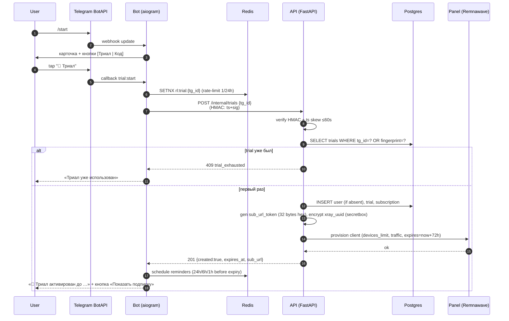
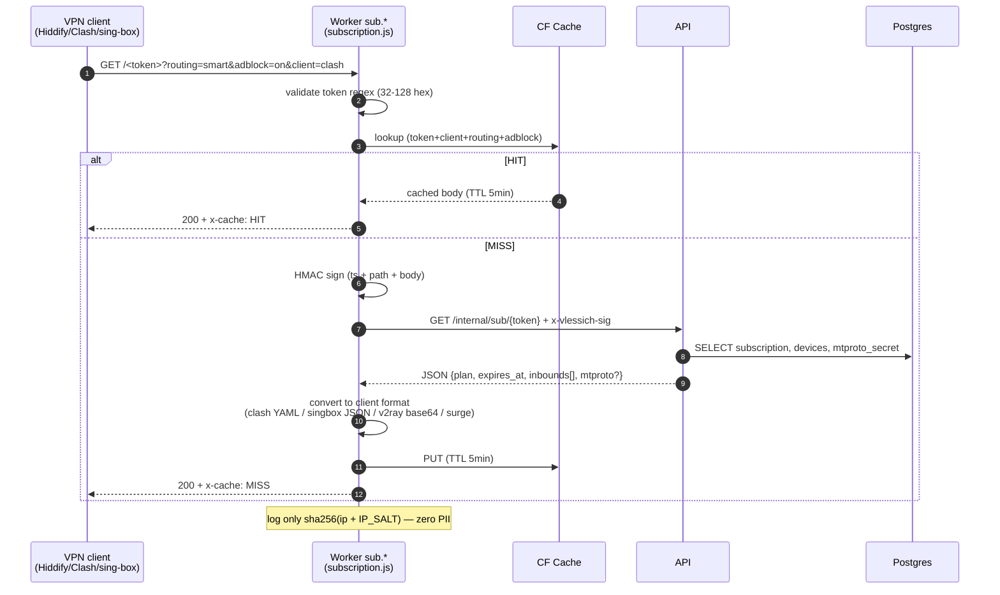
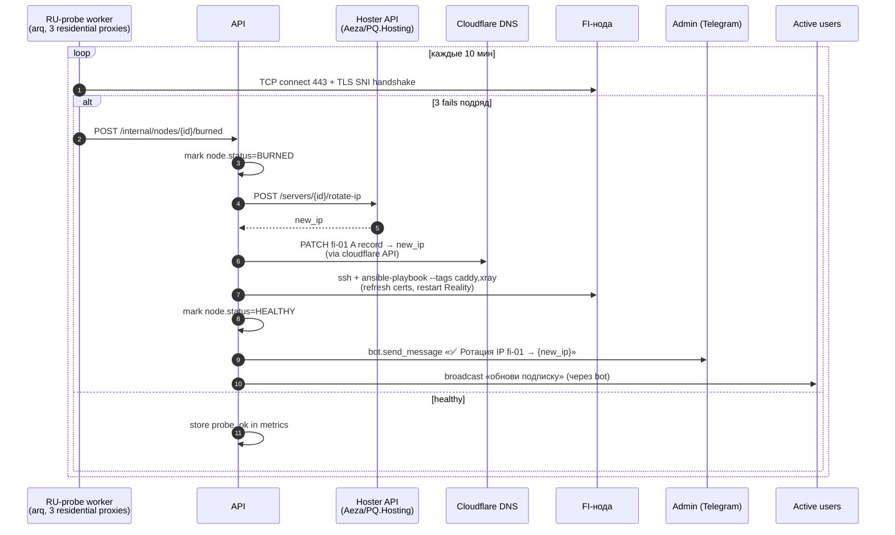
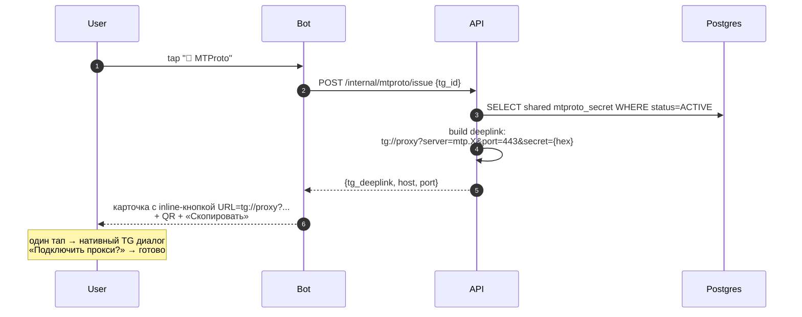
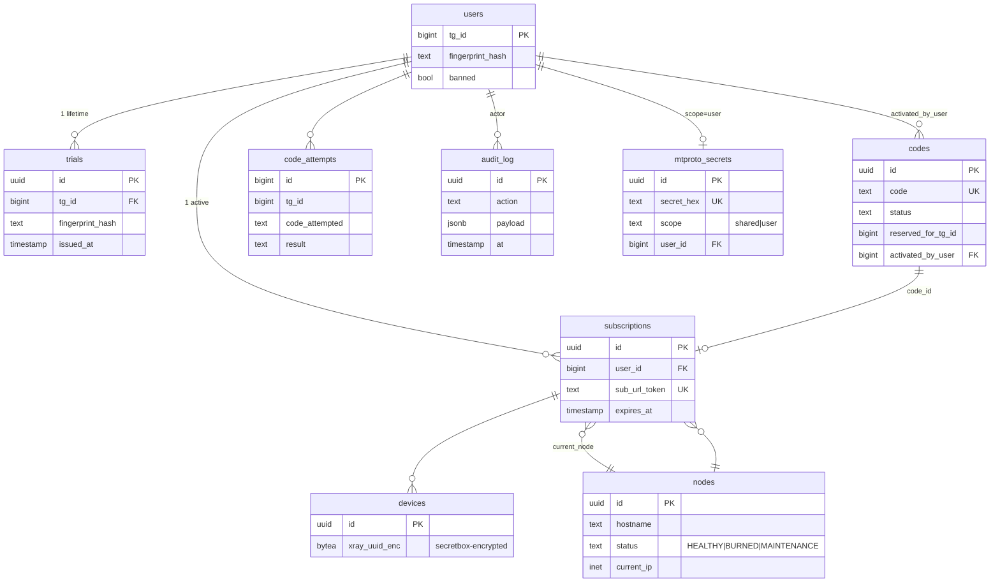

# Vlessich · Architecture

**Версия:** 1.0
**Дата:** 20.04.2026
**Источники:** `TZ.md` v1.3, `Design.txt`, `PROMPT.md`, текущий состав репо.

---

## 1. Зачем этот документ

Carta компонентов и потоков данных Vlessich. Используется как:

- ориентир при написании кода (что куда ходит, какой контракт);
- основа Definition-of-Done для каждого этапа (если поток не покрыт — этап не закрыт);
- entry-point для нового разработчика / агента.

Все выкладки опираются на ТЗ: §3 (архитектура), §11A (доменная инфра / Cloudflare),
§12 (БД), §10 (нода), §9A (MTProto).

---

## 2. Зоны ответственности

| Зона | Где живёт | Кто ходит туда |
|---|---|---|
| **Edge (CF)** | Cloudflare Pages + Workers + Access + WAF | пользователи, админы, клиенты VPN |
| **Control-plane** | Отдельный VPS (Linux + Docker) | bot, api, redis, postgres, panel (Remnawave) |
| **Data-plane (FI-нода)** | Helsinki VPS (Ubuntu 24.04 + Docker) | VPN-клиенты пользователей, MTProto-клиенты |
| **Storage / Secrets** | Postgres 16, Redis 7, sops+age | control-plane, api |
| **Observability** | Prometheus + Loki + Grafana + Uptime-Kuma | команда |

Жёсткое разделение: control-plane **никогда** не принимает VPN-трафик; FI-нода
**никогда** не получает прямой пользовательский HTTP к API.

---

## 3. Component diagram

```mermaid
flowchart TB
  subgraph TG["Telegram"]
    User(["👤 User<br/>(RU)"])
    Admin(["🛠 Admin"])
    BotAPI[["Telegram Bot API"]]
  end

  subgraph CFEdge["Cloudflare Edge (proxied)"]
    Pages_App["Pages: app.<br/>(webapp)"]
    Pages_Admin["Pages: admin.<br/>(admin panel)"]
    Worker_Sub["Worker: sub.<br/>(subscription.js)"]
    Worker_DoH["Worker: dns.<br/>(doh.js)"]
    Access["Zero Trust Access<br/>(admin only)"]
    WAF["WAF + RateLimit"]
  end

  subgraph CP["Control-plane VPS"]
    Bot["aiogram 3 bot<br/>(webhook)"]
    API["FastAPI<br/>(api.<domain>)"]
    Redis[("Redis 7<br/>FSM + RL + cache")]
    PG[("PostgreSQL 16")]
    Panel["Remnawave panel"]
    Workers_BG["arq workers<br/>(reminders, probes)"]
  end

  subgraph FI["FI Node — Helsinki (data-plane, non-proxied)"]
    Caddy["Caddy 2<br/>:80/:443 фасад"]
    Xray["Xray-core<br/>4 inbounds"]
    AGH["AdGuard Home<br/>127.0.0.1:53"]
    MTG["mtg<br/>:8443 MTProto"]
    NFT["nftables + fwknop<br/>+ Cowrie :22"]
    NodeAgent["Remnawave agent"]
  end

  subgraph Obs["Observability"]
    Prom["Prometheus"]
    Loki["Loki"]
    Graf["Grafana"]
    Kuma["Uptime-Kuma<br/>status.<domain>"]
  end

  subgraph Sec["Secrets / IaC"]
    Sops["sops + age"]
    TF["Terraform<br/>(infra/cloudflare.tf)"]
    Ans["Ansible<br/>(roles/node)"]
  end

  User -->|HTTPS| BotAPI
  BotAPI -->|webhook| WAF
  WAF --> Bot
  User -->|"Mini-App<br/>(initData)"| Pages_App
  Pages_App -->|"x-telegram-initdata"| WAF --> API

  Admin -->|browser + Email auth| Access --> Pages_Admin
  Pages_Admin -->|cookie| WAF --> API

  Bot <-->|HMAC<br/>x-vlessich-sig| API
  API <--> PG
  API <--> Redis
  Bot <--> Redis
  API -->|provision/revoke| Panel
  Panel -->|gRPC/HTTPS| NodeAgent
  Workers_BG --> API
  Workers_BG --> Bot

  User -->|"VPN client<br/>opens sub URL"| Worker_Sub
  Worker_Sub -->|HMAC<br/>/internal/sub/{token}| API
  Worker_Sub -->|"singbox/clash/<br/>v2ray response"| User

  User -->|"VPN tunnel<br/>VLESS+Reality+XHTTP/Vision/Hy2"| Xray
  User -->|"DoH<br/>(optional)"| Worker_DoH
  Xray -->|DNS queries| AGH
  AGH -->|upstream DoH/DoT| Worker_DoH

  User -->|"tg://proxy?...<br/>MTProto"| MTG

  Caddy -->|fallback target<br/>127.0.0.1:8443| Xray
  NFT -.protects.- Xray
  NFT -.protects.- MTG
  NFT -.protects.- Caddy
  NodeAgent -->|stats / config sync| Panel

  NodeAgent -->|node_exporter<br/>+ promtail| Prom & Loki
  API --> Prom
  Prom --> Graf
  Loki --> Graf

  Sops --> TF --> CFEdge
  Sops --> Ans --> FI
```

**Чтение:**

- сплошная стрелка `-->` — синхронный запрос/ответ;
- штриховая `-.->` — фоновое влияние (firewall защищает, но не «зовёт»);
- `<-->` — двунаправленный канал.

---

## 4. Domain map (поддомены)

| Поддомен | Тип | Назначение | TZ |
|---|---|---|---|
| `example.com` | proxied A → CP | Лендинг-фасад («Finnish Cloud Services») | §11A.1 |
| `www.` | proxied CNAME | alias для apex | §11A.1 |
| `api.` | proxied A → CP | FastAPI backend | §11A.1 |
| `app.` | proxied CNAME → Pages | Telegram Mini-App | §11A.7 |
| `admin.` | proxied CNAME → Pages, **Access-protected** | Admin panel | §11A.5 |
| `sub.` | proxied A → CP, **Worker route** | Subscription URL (edge) | §11A.3 |
| `dns.` | proxied A, **Worker route** | DoH endpoint | §11A.4 |
| `status.` | proxied A → CP | Uptime-Kuma | §11A.1 |
| `fi-01.` | **non-proxied** A | VPN inbound (Reality/XHTTP/Hy2) | §10 |
| `mtp.` | **non-proxied** A | MTProto-прокси (mtg) | §9A |

Cloudflare НЕ пропускает не-HTTP трафик → VPN/MTProto обязаны быть non-proxied.
Реальный IP светится только для `fi-01.` и `mtp.` — остальное скрыто за CF.

---

## 5. Sequence: Триал (Поток A, TZ §4.1)



**Edge cases:**
- Аккаунт <30 дней → бот просит share-phone до шага 4, fingerprint считается из `phone+tg_id+IP_SALT` (TZ §4.1).
- Если Panel вернула 5xx → API откатывает транзакцию (BEGIN/ROLLBACK), bot показывает retry-prompt.

---

## 6. Sequence: Активация кода (Поток B, TZ §4.2)

```mermaid
sequenceDiagram
    autonumber
    participant U as User
    participant B as Bot
    participant R as Redis
    participant A as API
    participant DB as Postgres
    participant P as Panel

    U->>B: tap "🔑 У меня есть код"
    B->>U: ACTIVATE_PROMPT (FSM=waiting_code)
    U->>B: "NEON-7F3K-P9QX"
    B->>B: regex /^[A-Z0-9]{4}(-[A-Z0-9]{4}){2}$/
    B->>R: INCR rl:code:{tg_id} (5/10min)
    alt rate-limit hit
        B-->>U: «Слишком много попыток» + капча (через 5)
    else ok
        B->>A: POST /internal/codes/activate {tg_id, code}
        A->>DB: BEGIN; SELECT FOR UPDATE codes WHERE code=?
        A->>A: validate status∈{CREATED}, valid_from≤now≤valid_until,<br/>reserved_for_tg_id ∈ {NULL, tg_id}
        alt invalid
            A->>DB: INSERT code_attempts (failed)
            A->>DB: COMMIT
            A-->>B: 422 {code: bad_code|expired|used|reserved}
            B-->>U: localized error
        else valid
            A->>DB: UPDATE codes SET status=ACTIVE, activated_by_user, activated_at
            A->>DB: UPSERT user; INSERT/UPDATE subscription<br/>(invariant: 1 active per user_id)
            A->>A: gen sub_url_token, encrypt xray_uuid
            A->>P: provision (devices_limit, traffic, expires=now+duration_days)
            P-->>A: ok
            A->>DB: INSERT audit_log
            A->>DB: COMMIT
            A-->>B: 200 {sub_url, expires_at, plan}
            B-->>U: ACTIVATE_OK card + [Показать подписку] [QR]
        end
    end
```

**Инвариант (TZ §4.5):** одна активная subscription на `user_id`.
Если у юзера уже есть subscription:
- статус `ACTIVE` → `expires_at += duration_days` (продление);
- статус `EXPIRED` → `expires_at = now + duration_days` (замена).

---

## 7. Sequence: Subscription URL (через CF Worker)



**Зачем edge:** снижает нагрузку на API в 50-100x при популярных подписках (один токен дёргается клиентом каждые 30 мин), даёт географическую близость к юзеру (CF anycast), скрывает реальный IP бэкенда.

---

## 8. Sequence: Ротация IP при «BURNED» (TZ §11)



**Когда ротировать:** после 3 фейлов подряд (~30 мин даунтайма).
Раньше — слишком чувствительно (false positives от operator-side hiccups).

---

## 9. Sequence: MTProto issuance (TZ §9A)



**Без VPN-клиентов**, работает даже если Telegram частично режется — клиент сам
ходит через прокси.

---

## 10. Database schema (high-level)

См. TZ §12 для полей. Ниже — отношения:



Шифрование at-rest:
- `devices.xray_uuid_enc` — libsodium secretbox (`API_SECRETBOX_KEY`).
- `codes.code` — оставляем plaintext (нужен SELECT WHERE code=?), но защищаем
  на уровне БД (row-level), а **в логах** — только префикс `XXXX-****-****`.

---

## 11. Security boundaries

| Граница | Защита |
|---|---|
| User → bot/api | Cloudflare WAF + rate-limit (10/min `/activate`, 3/h `/trial`) |
| bot ↔ API | HMAC-SHA256 (`x-vlessich-sig`), clock skew ≤60s, общий `API_INTERNAL_SECRET` |
| sub-Worker ↔ API | тот же HMAC, secret в CF binding |
| webapp → API | Telegram `initData` (HMAC от bot_token, проверка на стороне API) |
| admin → API | Cloudflare Zero Trust Access (email-allowlist + опц. IP), cookie/JWT downstream |
| API ↔ DB | unix socket / loopback в compose, в prod — sslmode=require |
| FI-нода SSH | fwknop SPA → custom port → key-only, Cowrie на :22 |
| FI-нода internet | nftables drop policy, RST на незнакомые порты, scanner blocklist |

**No-PII rule:** все логи (bot, api, workers, AGH) хранят IP только как
`sha256(ip + IP_SALT)`. Телефоны хешируются перед записью fingerprint.
Логи Telegram-username — допустимы, но опционально.

---

## 12. Deploy topology

```mermaid
flowchart LR
    Dev["Developer laptop"] -->|git push| GH["GitHub repo"]
    GH -->|Actions| GHCR["GHCR<br/>(bot, api images)"]
    GH -->|Actions| Pages["CF Pages<br/>(webapp, admin)"]
    Dev -->|terraform apply<br/>(sops decrypt)| CF["Cloudflare<br/>(DNS+Workers+Access+WAF)"]
    Dev -->|"make deploy-node<br/>HOST=fi-01"| FI["FI VPS<br/>(ansible-playbook)"]
    GHCR -->|watchtower / manual pull| CP["Control-plane VPS"]
```

Никаких автоматических deploy в FI/CP без явной команды (`make`). Pages /
Workers / DNS — через Terraform plan→apply. Изменения в `cloudflare.tf` без
PR-ревью запрещены.

---

## 13. Open questions (для следующих этапов)

| # | Вопрос | Этап решения |
|---|---|---|
| Q1 | Remnawave vs Marzban в MVP — ТЗ допускает оба | Этап 1 (до создания клиента) |
| Q2 | Нужна ли отдельная микро-нода под mtg, или достаточно той же FI | Этап 2.5 |
| Q3 | Reality `serverNames` — `www.microsoft.com` или ротировать список | Этап 2 (после запуска первого Reality probe) |
| Q4 | Хранить ли `tg_username` в users (UX vs PII) | Этап 1 (до создания миграции) |
| Q5 | Public free-tier MTProto (TZ §9A.6) — включаем в MVP? | Этап 4 (после боевой проверки) |

---

## 14. Mini-App ↔ Backend contract (Stage 3)

### Auth: Telegram initData (TZ §11B)

Webapp шлёт в каждом запросе заголовок `x-telegram-initdata: <raw query>`.
Backend проверяет:

```
secret_key = HMAC_SHA256(key=b"WebAppData", msg=bot_token)
expected   = HMAC_SHA256(key=secret_key, msg=data_check_string).hex()
hmac.compare_digest(expected, fields["hash"])
assert now - fields["auth_date"] <= 86400
```

`data_check_string` — поля `k=v`, отсортированные по ключу, через `\n`,
**без** `hash`. Реализация: `app/auth/telegram.py::verify_init_data`.

### Endpoints

| Path                                      | Auth     | Notes                                 |
|-------------------------------------------|----------|---------------------------------------|
| `GET /v1/webapp/bootstrap`                | initData | `{user, subscription|null}`           |
| `GET /v1/webapp/subscription`             | initData | `{sub_token, urls, devices, flags}`   |
| `POST /v1/webapp/subscription/toggle`     | initData | `{adblock?, smart_routing?}` — 422 if both null |
| `POST /v1/webapp/devices/{id}/reset`      | initData | RL 5/min/user; 403 if not owner       |

### Sub-URL format (public, для VPN-клиентов)

`https://<settings.sub_worker_base_url>/<sub_token>?client=<v2ray|clash|singbox|surge|raw>`

Mini-App получает только URL-список — **не проксирует** VPN payload.
Edge sub-Worker конвертирует в нужный формат (Stage 2 T8).

### Deeplink схемы импорта

- v2rayNG: `v2rayng://install-sub/?url=<enc>&name=Vlessich`
- Clash: `clash://install-config?url=<enc>&name=Vlessich`
- sing-box: `sing-box://import-remote-profile?url=<enc>&name=Vlessich`
- Surge: `surge:///install-config?url=<enc>`

Builders: `webapp/src/lib/deeplinks.ts`.

## 15. Admin UI ↔ Backend contract (Stage 4)

### Stack

React 18 + Vite + TS + Tailwind + **TanStack Query v5**. Spotify-dark по
`Design.txt`. Хост: `admin/` (порт dev 5174). В прод — статика за
Cloudflare Access.

### Auth: JWT Bearer

`POST /admin/auth/login` `{email, password}` → `{access_token, role}`
(HS256, TTL 1h). Токен хранится в `sessionStorage` под ключом
`vlessich.admin.jwt`. На любой `401` от backend — клиент чистит токен и
делает `window.location.assign("/login")`. Никаких refresh-токенов в
Stage 4 (по locked-решению — пользователь логинится заново раз в час).

### RBAC matrix

| Endpoint | readonly | support | superadmin |
|---|---|---|---|
| `GET /admin/stats` | ✓ | ✓ | ✓ |
| `GET /admin/codes`, `/users`, `/subscriptions`, `/audit`, `/nodes` | ✓ | ✓ | ✓ |
| `GET /admin/nodes/{id}/health` | ✓ | ✓ | ✓ |
| `POST /admin/codes`, `DELETE /admin/codes/{id}` | — | ✓ | ✓ |
| `POST /admin/subscriptions/{id}/revoke` | — | ✓ | ✓ |
| `POST /admin/nodes`, `PATCH /admin/nodes/{id}` | — | — | ✓ |

Frontend дополнительно скрывает кнопки через `hasRole(actual, required)`
с ranks `superadmin=3 > support=2 > readonly=1`.

### Endpoints (Stage 4 additions)

| Path | Auth | Notes |
|---|---|---|
| `GET /admin/stats` | JWT | Сводка для dashboard (10 counts: users/codes/subs/nodes buckets) |
| `POST /admin/subscriptions/{id}/revoke` | JWT support+ | `status=REVOKED`, `expires_at=now()` |
| `GET /admin/nodes/{id}/health` | JWT | `uptime_24h_pct`, `latency_p50/p95_ms`, recent 50 probes |

### Node health pipeline

Таблица `node_health_probes`:
```
id          uuid  pk
node_id     uuid  fk → nodes.id
probed_at   timestamptz
ok          bool
latency_ms  int  null
error       text null
INDEX (node_id, probed_at DESC)
```

Сейчас probes пишутся внешним процессом / Stage 5 active prober. Admin
UI читает их через `GET /admin/nodes/{id}/health`. Расчёты:

- `uptime_24h_pct` = `100 * count(ok) / count(*)` за последние 24h.
- `latency_p50_ms`, `latency_p95_ms` — percentile_cont на `latency_ms`
  где `ok=true`.

### TanStack Query keys (convention)

```
["stats"]
["codes", { status, plan, tag, page }]
["users", { tg_id, page }]
["subs",  { status, plan, user_id, page }]
["audit", { action, actor_type, page }]
["nodes"]
["node-health", id]
```

Refetch intervals:
- `["stats"]` — 30s (Dashboard)
- `["nodes"]` — 30s (NodesPage)
- `["node-health", id]` — 15s (NodeHealthDrawer, только пока открыт)

### Design-system inventory

См. `admin/README.md` — полный список компонентов в `admin/src/components/`.


Решения фиксируем в `docs/decisions/NNN-*.md` (ADR) по мере принятия.
